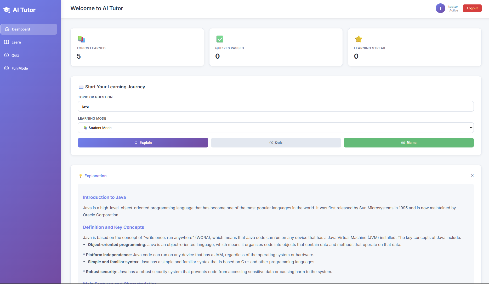
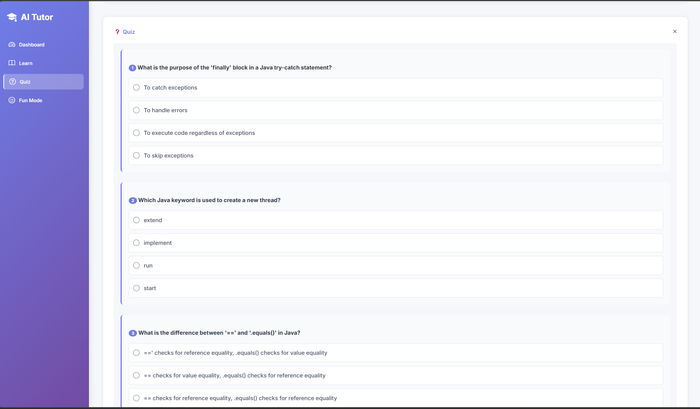

# AI Tutor 🤖📚

[](https://nodejs.org/)
[](https://expressjs.com/)
[](https://groq.com/)
[](LICENSE)

A cutting-edge AI-powered educational platform that makes learning engaging, personalized, and fun. Built with modern web technologies and powered by Groq's lightning-fast AI models, AI Tutor provides intelligent explanations, interactive quizzes, and even meme-based learning to revolutionize the way students absorb knowledge.

## 🖼️ Live UI Preview

<div align="center">
  
  <p><em>AI Tutor dashboard showing topic cards, progress metrics, and navigation.</em></p>
  
  <p><em>Generated quiz interface with questions and multiple choice answers.</em></p>
</div>

## ✨ Features

### 🎓 Intelligent Learning Modes
- **Learn Mode**: Comprehensive, structured explanations with definitions, examples, and applications
- **Professor Mode**: Advanced, university-level explanations with technical depth and real-world applications
- **Friend Mode**: Casual, conversational explanations with analogies and encouraging tips
- **Fun Mode**: Humorous explanations using jokes, puns, and entertaining analogies
- **Quiz Mode**: Interactive multiple-choice questions with progressive difficulty

### 😂 Meme-Based Learning
- AI-generated educational memes using popular templates (Success Kid, Bad Luck Brian, etc.)
- Combines humor with learning to improve retention and engagement
- Automatic caption generation tailored to educational topics

### 🔐 User Management
- Secure user registration and authentication with JWT tokens
- Password hashing with bcrypt for maximum security
- Personalized learning history tracking
- Session management with 7-day token expiration

### 📊 Progress Tracking
- Automatic history recording of learning sessions
- Recent activity dashboard
- Performance insights and learning patterns

### 🚀 High Performance
- Powered by Groq's ultra-fast Llama 3.3 70B model
- Sub-second response times for explanations and quizzes
- Efficient Node.js/Express backend with optimized API calls

## 🛠️ Tech Stack

### Backend
- **Runtime**: Node.js 18+
- **Framework**: Express.js 5.x
- **AI Engine**: Groq API (OpenAI-compatible)
- **Authentication**: JWT + bcrypt
- **Data Storage**: JSON file-based (easily replaceable with databases)
- **CORS**: Enabled for cross-origin requests

### Frontend
- **HTML5/CSS3**: Modern responsive design
- **Vanilla JavaScript**: No heavy frameworks for fast loading
- **Bootstrap Icons**: Beautiful iconography
- **Google Fonts**: Inter font family for readability

### External Services
- **Groq AI**: For natural language processing and content generation
- **Imgflip API**: For meme template generation

## 📋 Prerequisites

- Node.js 18 or higher
- npm or yarn package manager
- Valid Groq API key
- Imgflip account (for meme generation)

## 🚀 Installation

1. **Clone the repository**
   ```bash
   git clone https://github.com/yourusername/ai-tutor.git
   cd ai-tutor
   ```

2. **Install dependencies**
   ```bash
   npm install
   ```

3. **Configure environment variables**
   ```bash
   cp env.example .env
   ```

   Edit `.env` with your actual credentials:
   ```env
   GROQ_API_KEY=your_actual_groq_api_key
   IMGFLIP_USERNAME=your_imgflip_username
   IMGFLIP_PASSWORD=your_imgflip_password
   JWT_SECRET=your_super_secret_jwt_key_change_this_in_production
   ```

4. **Start the application**
   ```bash
   npm start
   ```

5. **Access the application**
   Open your browser and navigate to `http://localhost:5000`

## ⚙️ Configuration

### Environment Variables

| Variable | Description | Required |
|----------|-------------|----------|
| `GROQ_API_KEY` | Your Groq API key for AI services | Yes |
| `IMGFLIP_USERNAME` | Imgflip account username for meme generation | Yes |
| `IMGFLIP_PASSWORD` | Imgflip account password | Yes |
| `JWT_SECRET` | Secret key for JWT token signing | Yes |

### Port Configuration

The application runs on port 5000 by default. To change this, modify the port in `server.js`:

```javascript
const PORT = process.env.PORT || 5000;
```

## 📖 Usage

### Web Interface
1. Register a new account or login with existing credentials
2. Enter a topic you want to learn about
3. Select your preferred learning mode
4. Explore explanations, take quizzes, or enjoy educational memes
5. View your learning history in the dashboard

### API Usage

#### Authentication
```javascript
// Register
POST /register
{
  "username": "student123",
  "password": "securepassword",
  "email": "student@example.com"
}

// Login
POST /login
{
  "username": "student123",
  "password": "securepassword"
}
```

#### Learning Endpoints
```javascript
// Get explanation
POST /explain
Authorization: Bearer <jwt_token>
{
  "topic": "machine learning",
  "mode": "learn" // or "professor", "friend", "fun", "quiz"
}

// Generate meme
POST /meme
Authorization: Bearer <jwt_token>
{
  "topic": "quantum physics"
}

// Get learning history
GET /history
Authorization: Bearer <jwt_token>
```

## �️ Screenshots

Add your UI screenshots to the repository (example path: `docs/screenshots/`) and then include them here. This helps users immediately understand the interface.


*AI Tutor dashboard showing topic cards, progress metrics, and navigation.*


*Generated quiz interface with questions and multiple choice answers.*

## 📁 Project Structure

```
AI-Tutor-main/
├── server.js              # Main Express server
├── package.json           # Dependencies and scripts
├── public/
│   └── index.html         # Frontend application
├── data/
│   ├── users.json         # User data storage
│   └── history.json       # Learning history storage
├── docs/
│   └── screenshots/       # Suggested place for README images
├── env.example            # Environment variables template
├── README.md              # This file
└── LICENSE                # ISC License
```

## 🤝 Contributing

We welcome contributions! Here's how you can help:

1. **Fork the repository**
2. **Create a feature branch**
   ```bash
   git checkout -b feature/amazing-feature
   ```
3. **Make your changes**
4. **Test thoroughly**
5. **Commit your changes**
   ```bash
   git commit -m 'Add amazing feature'
   ```
6. **Push to the branch**
   ```bash
   git push origin feature/amazing-feature
   ```
7. **Open a Pull Request**

### Development Guidelines
- Follow ESLint configuration for code style
- Write meaningful commit messages
- Add tests for new features
- Update documentation as needed
- Ensure all dependencies are up-to-date

## 🗺️ Roadmap: Taking AI Tutor to the Next Level

### Phase 1: Enhanced Learning Experience (Q2 2024)
- [ ] **Adaptive Learning**: AI analyzes user performance to customize difficulty and content
- [ ] **Multimedia Support**: Add video explanations and interactive diagrams
- [ ] **Progress Analytics**: Detailed dashboards with learning streaks and achievements
- [ ] **Offline Mode**: Download content for offline learning

### Phase 2: Social & Collaborative Features (Q3 2024)
- [ ] **Study Groups**: Create and join collaborative learning communities
- [ ] **Peer Teaching**: Students can create and share custom explanations
- [ ] **Discussion Forums**: Topic-specific discussion boards
- [ ] **Gamification**: Badges, leaderboards, and learning challenges

### Phase 3: Advanced AI Integration (Q4 2024)
- [ ] **Multi-Modal AI**: Support for image and voice inputs
- [ ] **Personal AI Tutor**: Custom AI personalities and teaching styles
- [ ] **Real-time Collaboration**: Live tutoring sessions with AI moderation
- [ ] **Content Generation**: AI creates custom textbooks and study guides

### Phase 4: Enterprise & Scale (2025)
- [ ] **Database Migration**: Move from JSON to PostgreSQL/MongoDB
- [ ] **Microservices Architecture**: Split into independent services
- [ ] **Mobile Apps**: Native iOS and Android applications
- [ ] **API Marketplace**: Third-party integrations and plugins
- [ ] **Multi-Language Support**: Localization for global education
- [ ] **Integration APIs**: Connect with LMS platforms (Canvas, Moodle, etc.)

### Phase 5: AI Revolution (2026+)
- [ ] **VR/AR Learning**: Immersive educational experiences
- [ ] **Predictive Analytics**: Forecast student performance and intervene early
- [ ] **Global Accessibility**: AI translation for universal education
- [ ] **Blockchain Credentials**: Verifiable digital certificates
- [ ] **AI Research Integration**: Latest educational research automatically applied

### Technical Improvements
- [ ] **Performance Optimization**: Implement caching, CDN, and edge computing
- [ ] **Security Hardening**: Advanced security audits and penetration testing
- [ ] **Scalability**: Kubernetes deployment and auto-scaling
- [ ] **Monitoring**: Comprehensive logging and error tracking
- [ ] **Testing**: 95%+ code coverage with automated testing pipelines

### Community & Impact
- [ ] **Open Source Curriculum**: Community-contributed learning modules
- [ ] **Partnerships**: Collaborate with universities and educational institutions
- [ ] **Research Publications**: Academic papers on AI-assisted learning
- [ ] **Global Reach**: Translation and localization for 50+ languages
- [ ] **Impact Measurement**: Track educational outcomes and success metrics

## 📄 License

This project is licensed under the ISC License - see the [LICENSE](LICENSE) file for details.

## 🙏 Acknowledgments

- **Groq** for providing ultra-fast AI inference
- **Imgflip** for meme template APIs
- **OpenAI** for inspiring the AI education revolution
- **The open-source community** for amazing tools and libraries

## 📞 Support

If you have questions, issues, or feature requests:

1. Check the [Issues](https://github.com/yourusername/ai-tutor/issues) page
2. Create a new issue with detailed information
3. Join our community discussions

---

**Made with ❤️ for learners worldwide. Let's democratize education through AI!**
